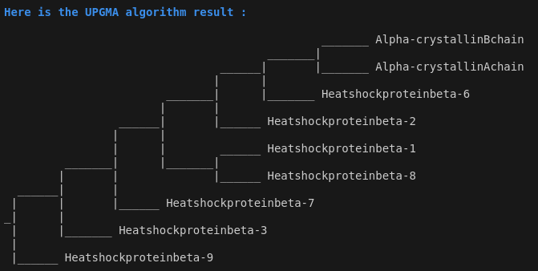
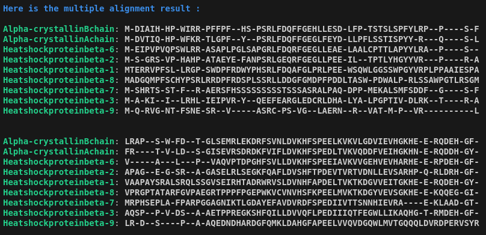

# PROJECT CLUSTAL

This program aims at reproducing the algorithm of Clustal. Clustal is a progressive multiple alignment algorithm. In this project, we are simplifiying the algorithm.

The three major steps are :

1. Pairwise alignment of sequences with Needleman and Wunsch algorithm.

2. Hierarchial clustering with UPGMA algorithm of the normalized scores generated from step 1.

3. Multiple sequence alignement from step 2 order.

## INSTALLATION

By cloning this projet :

        git clone git@github.com:gnanalin/ClustalLite.git

## CONDA INITIALIZATION

In order to have reproducible results, I used CONDA. If you don't have CONDA and want to install it, please refer to this page : [link_miniconda_installation](https://docs.anaconda.com/miniconda/)

In order to run the code, you have to create an environnement thanks to the YAML file (`environement.yml`) in the directory `ClustalLite`. 

To setup and use the environnement, you can do :

        conda env create -f environment.yml
        conda activate env_clustallite

You are now ready to start the programm.

## THE FOLDERS AND FILES

In your `ClustalLite` folder, you can find a folder named `data` which contains the fasta file and the blosum matrix [link_matrix](https://github.com/dmnfarrell/epitopepredict/blob/master/epitopepredict/mhcdata/blosum62.csv) and another folder
named `src` which contains several scripts :

- `needleman_wunsch_method.py` : contains the functions to implement needleman_wunsch algorithm (step 1).

- `upgma_method.py` : contains the functions to implement upgma algorithm (step 2) from step1 results.

- `multiple_alignment.py` : contains the functions to implement the approximative clustal alignment (step3) from step1 and step2.

- `main.py` : regroups the three previous steps.

## THE PROGRAM

In order to run the multiple alignment, you can do :

        python src/main.py --fasta data/fasta_file

where `fasta_file` contains the sequences you wish to align. Make sure to have sequences names with no spaces and sequences length <= 1000 amino acids to have 
fast (<=2 minutes approximately) results.

If you just want to try my programm, you can use the `example.fasta` file you have in the `data` folder.

## RESULTS 

For each of our three steps, you will get a result in the terminal :

**step0 :**

**step1 :**

**step2 :**

**step3 :**

